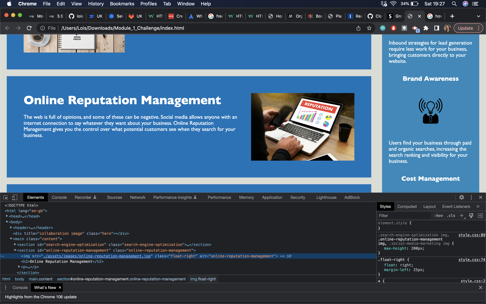

# Module_1_Challenge
This is a github repro for Module 1's Challenge. As web accessibility is an increasingly important consideration for businesses, this project was launched to ensures that people with disabilities can access the website. You will also see in this project that the codebase has been improved, to allow for long-term sustainability. Links are now functioning correctly and the CSS has been efficiently reworked through consolitation and organisation.


## Installation

Please follow the below steps to install this project:
1. Access the repository on GitHub - https://github.com/loishunt/Module_1_Challenge
2. Clone the repositry by clicking 'code' and copying the link
3. On your machine terminal, input the following command - git clone (pasted link)
4. Open the repository on your chosen code app


## Usage 

Below you will find a screenshot of the functioning alt text feature that has been added to this existing project.

```md

```

## License

This project is free and open-source software licensed under MIT licencing.


